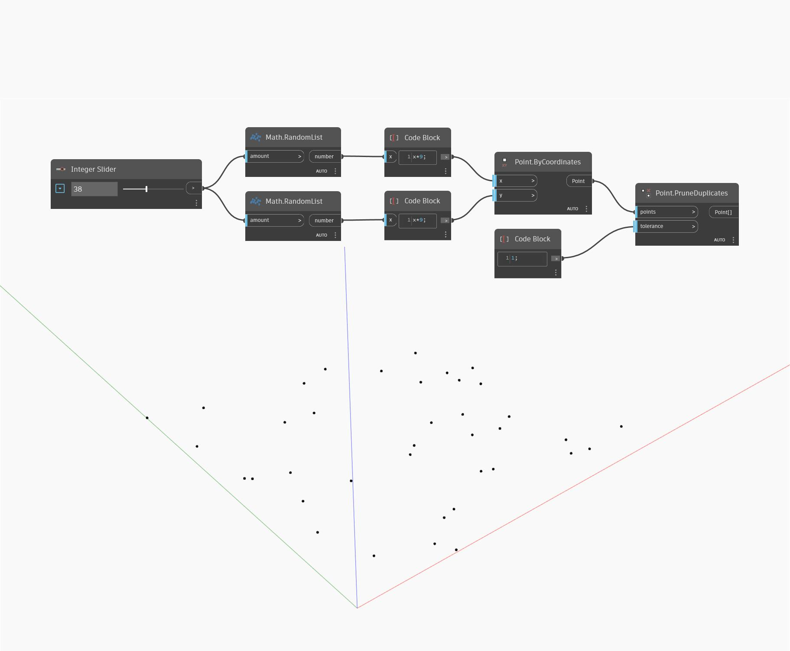

## Em profundidade
Prune Duplicates toma uma lista de pontos como entrada e retornará uma lista com pontos duplicados removidos. A entrada de tolerância é usada para determinar a proximidade necessária de dois pontos para que sejam considerados duplicados. Se dois pontos estiverem mais próximos que a tolerância, o primeiro na lista será mantido e o outro ponto será removido. No exemplo, geramos um conjunto de pontos aleatórios. Em seguida, usamos a opção Prune Duplicates com uma tolerância de um para remover quaisquer pontos que estejam mais próximo de uma unidade a outro ponto.
___
## Arquivo de exemplo

