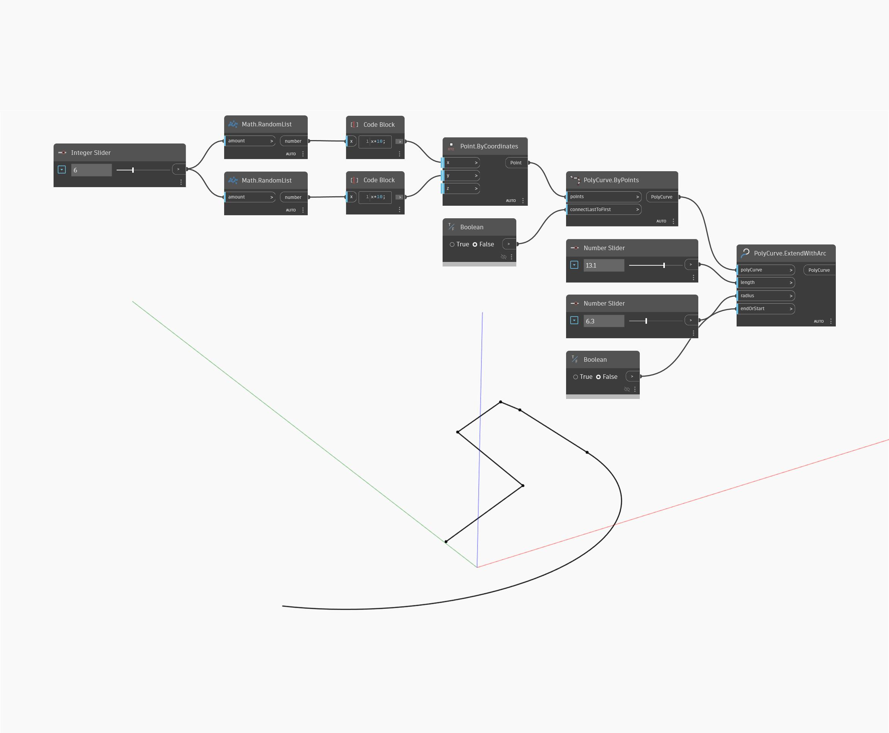

## Em profundidade
Extend With Arc adicionará um arco circular ao início ou ao final de uma PolyCurve de entrada e retornará uma PolyCurve combinada única. A entrada do raio determinará o raio do círculo, enquanto a entrada do comprimento determinará a distância ao longo do círculo para o arco. O comprimento total deve ser menor ou igual ao comprimento de um círculo completo com o raio fornecido. O arco gerado será tangente ao final da PolyCurve de entrada. Uma entrada booleana para endOrStart controla em qual extremidade da PolyCurve o arco será criado. Um valor de `true` resultará no arco criado no final da PolyCurve, enquanto `false` criará o arco no início da PolyCurve. No exemplo abaixo, primeiro usaremos um conjunto de pontos aleatórios e PolyCurve By Points para gerar um PolyCurve. Em seguida, usamos dois controles deslizantes de número e um botão de alternância booleano para definir os parâmetros para ExtendWithArc.
___
## Arquivo de exemplo

