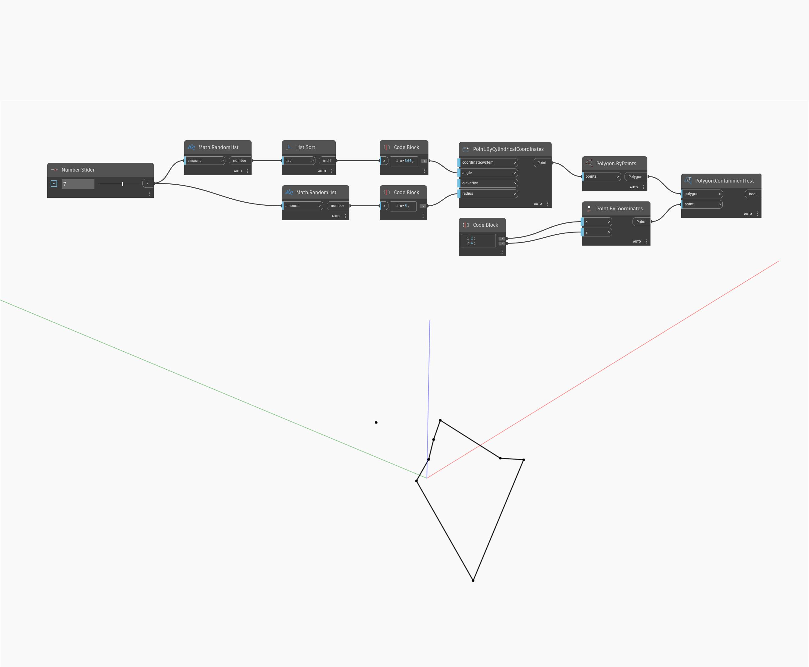

## Em profundidade
Containment Test retorna um valor booleano dependendo se um determinado ponto está contido dentro de um determinado polígono. O polígono deve ser plano e não efetuar interseção para que isso funcione. No exemplo abaixo, criamos um polígono usando uma série de pontos criados por By Cylindrical Coordinates. Deixar a elevação constante e classificar os ângulos assegura um polígono plano e que não efetua interseção. Em seguida, criamos um ponto para testar e usamos ContainmentTest para ver se o ponto está dentro ou fora do polígono.
___
## Arquivo de exemplo

