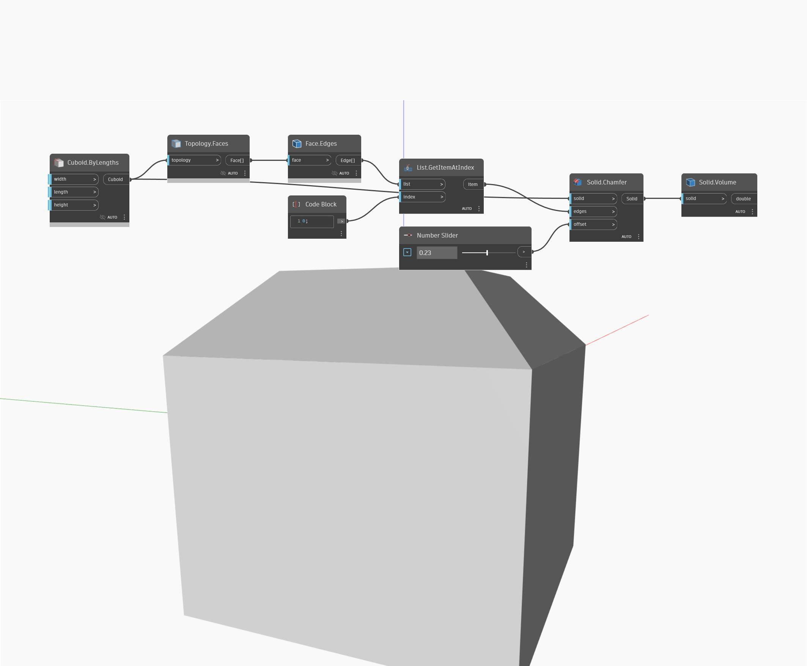

## Em profundidade
Volume retornará o volume de um determinado sólido. No exemplo abaixo, começamos com um cubo e, em seguida, chanframos as arestas para produzir um novo sólido. Podemos usar Volume para encontrar o novo volume desse sólido.
___
## Arquivo de exemplo

