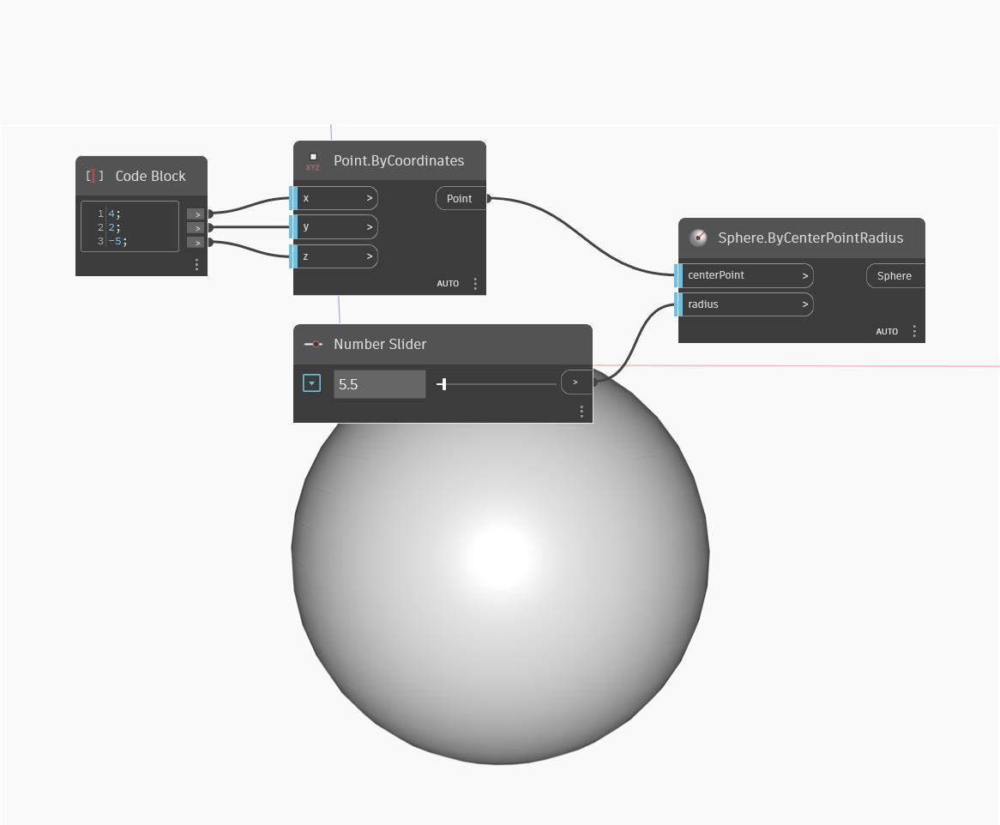

## Em profundidade
Sphere by Center Point Radius criará uma esfera centralizada no ponto de entrada e com um raio de entrada. No exemplo abaixo, usamos um bloco de código para especificar as coordenadas de um ponto criado por coordenadas e usamos um controle deslizante de número para determinar o raio da esfera.
___
## Arquivo de exemplo

