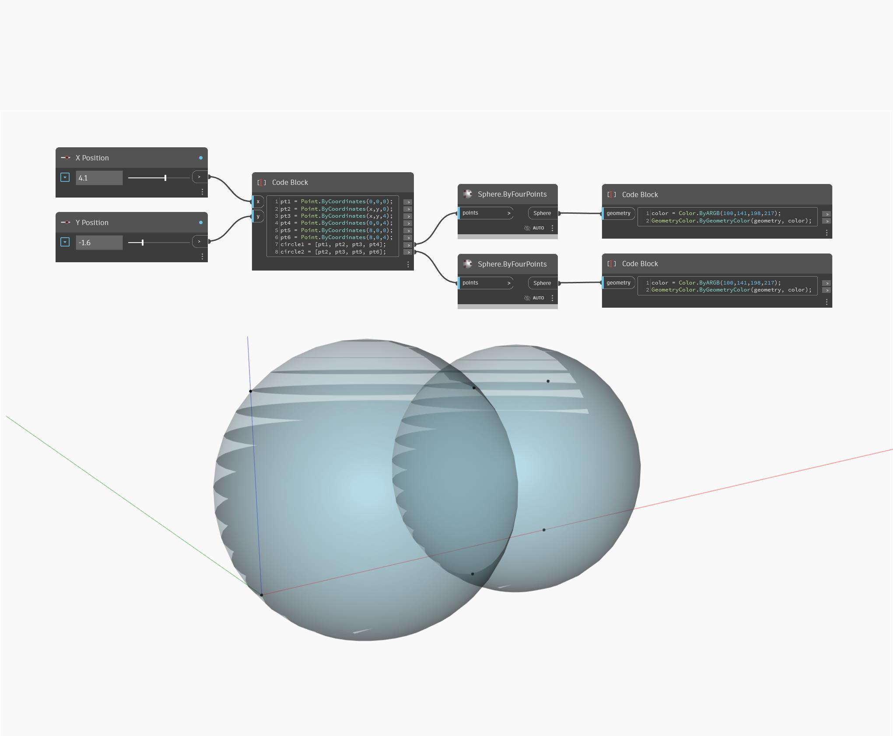

## Em profundidade
ByFourPoints retornará uma esfera de quatro pontos de entrada na superfície. No exemplo abaixo, duas esferas são criadas com base em um conjunto de seis pontos. Ajustar os controles deslizantes da Posição X e da Posição Y alterará o tamanho de cada esfera com relação à outra. É importante observar que nenhum conjunto de quatro pontos criará uma esfera. É possível que todos os pontos estejam na superfície da esfera.
___
## Arquivo de exemplo

