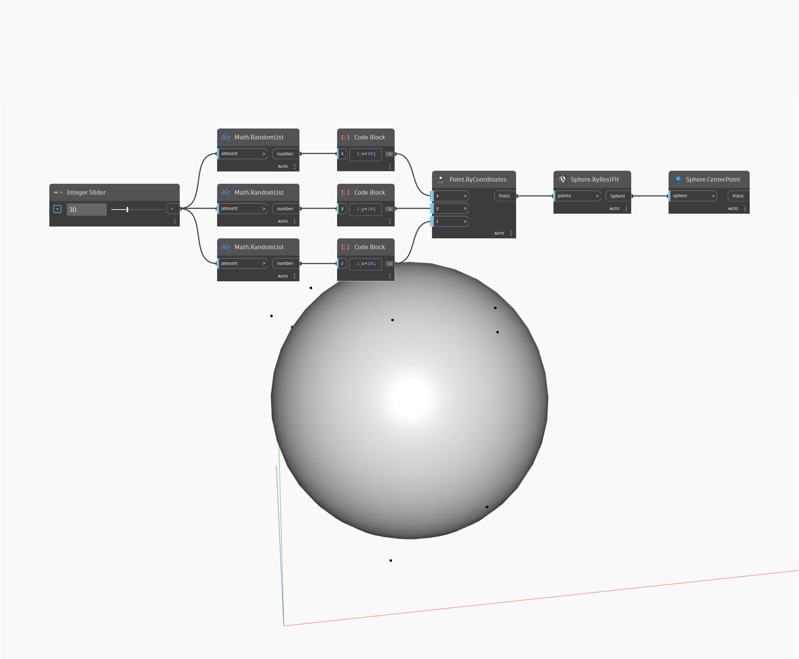

## Em profundidade
Center Point retornará o centro de uma esfera de entrada. No exemplo abaixo, usamos um nó ByBestFit para criar uma esfera com base em um conjunto de pontos aleatórios. em seguida, usamos um nó CenterPoint para determinar o centro da esfera de melhor ajuste.
___
## Arquivo de exemplo

