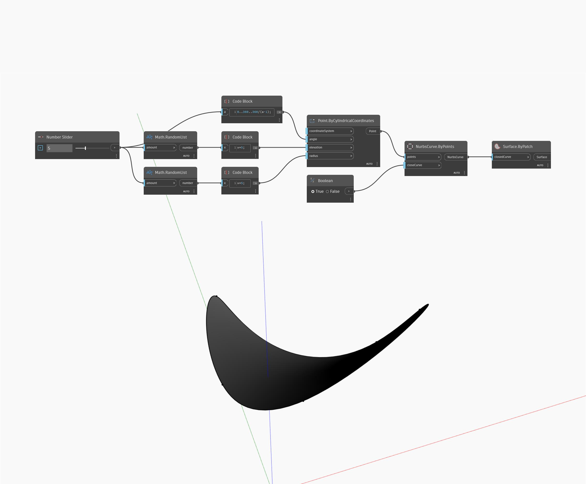

## Em profundidade
Surface by Patch criará uma superfície preenchendo o interior de uma curva fechada. No exemplo abaixo, primeiro criaremos uma curva Nurbs fechada usando uma série de pontos criados com coordenadas cilíndricas. Um controle deslizante de número controla o número de pontos a serem criados, enquanto um nó booleano de alternância controla se a curva Nurbs está fechada em não. Usamos a curva Nurbs como entrada para um nó Surface ByPatch, criando uma superfície no interior da curva fechada.
___
## Arquivo de exemplo

