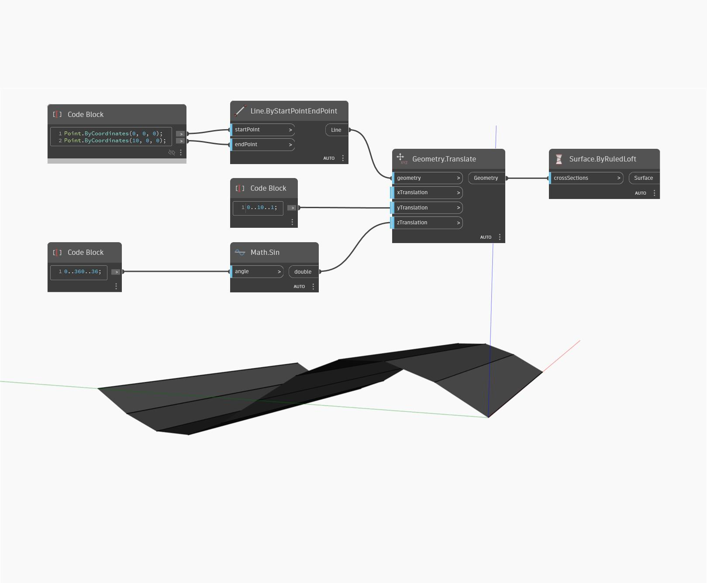

## Em profundidade
Superfície by Ruled Loft usa uma lista ordenada de curvas como entrada e eleva uma superfície regular de linha reta entre as curvas. Comparada com ByLoft, ByRuledLoft pode ser um pouco mais rápida, mas a superfície resultante é menos suave. No exemplo abaixo, começamos com uma linha ao longo do eixo X. Convertemos essa linha em uma série de linhas que seguem uma curva senoidal na direção y. Usar essa lista resultante de linhas como entrada para uma superfície ByRuledLoft resulta em uma superfície com segmentos de linha reta entre as curvas de entrada.
___
## Arquivo de exemplo

