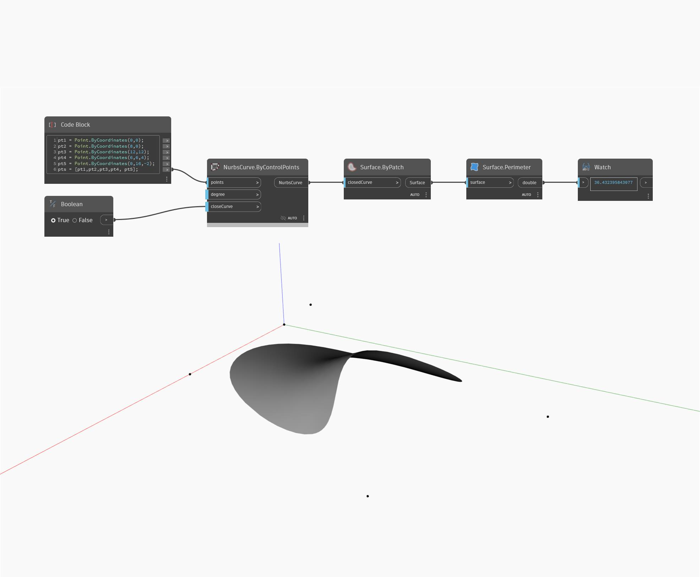

## Em profundidade
Perimeter retornará o comprimento do perímetro de uma superfície como um duplo. No exemplo abaixo, um perímetro de NurbsSurface complexo retornará um valor de 36,432.
___
## Arquivo de exemplo

