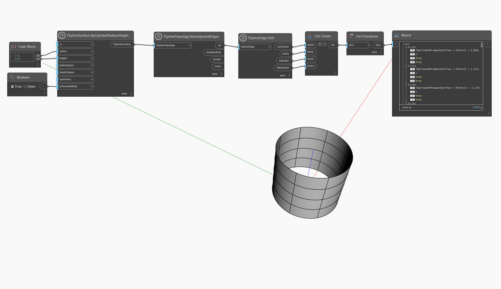

## In-Depth
`TSplineEdge.Info` retorna as seguintes propriedades de uma aresta de superfície da T-Spline:
- `uvnFrame`: ponto na cobertura, vetor U, vetor V e vetor normal da aresta da T-Spline
- `index`: o índice da aresta
- `isBorder`: se a aresta escolhida é uma borda da superfície da T-Spline
- `isManifold`: se a aresta escolhida é múltipla

No exemplo abaixo, `TSplineTopology.DecomposedEdges` é usado para obter uma lista de todas as arestas de uma superfície do primitivo de cilindro da T-Spline, e `TSplineEdge.Info` é usado para investigar suas propriedades.

## Arquivo de exemplo

