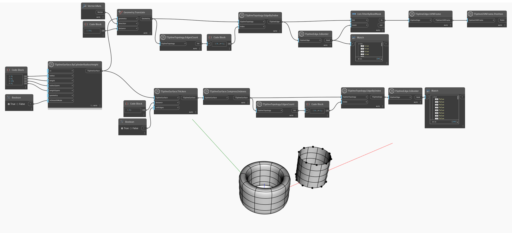

## In-Depth
`TSplineEdge.IsBorder` retornará `True` se a aresta da T-Spline de entrada for uma borda.

No exemplo abaixo, as arestas de duas superfícies T-Spline são investigadas. As superfícies são um cilindro e sua versão engrossada. Para selecionar todas as arestas, os nós `TSplineTopology.EdgeByIndex` são usados em ambos os casos, com a entrada de índices - um intervalo de inteiros que vão de 0 a n, em que n é o número de arestas fornecido por `TSplineTopology.EdgesCount`. Essa é uma alternativa para selecionar diretamente arestas usando `TSplineTopology.DecomposedEdges`. `TSplineSurface.CompressIndices` é usado adicionalmente no caso de um cilindro engrossado para reordenar os índices de aresta.
Um nó `TSplineEdge.IsBorder` é usado para verificar quais das arestas são arestas de borda. A posição das arestas de borda do cilindro plano é realçada com a ajuda dos nós `TSplineEdge.UVNFrame` e `TSplineUVNFrame.Position`. O cilindro engrossado não tem arestas de borda.

## Arquivo de exemplo

