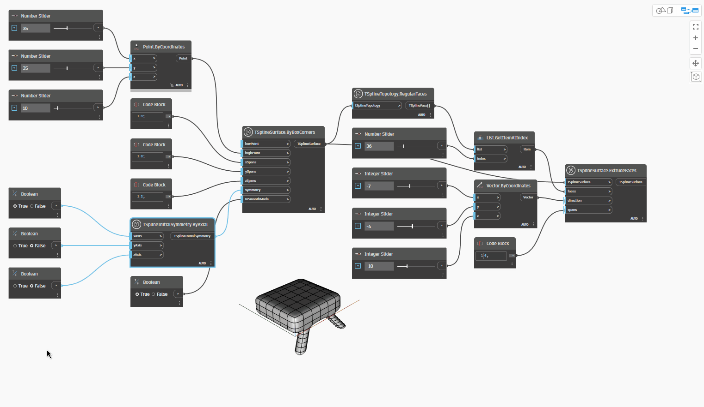

## Em profundidade
`TSplineInitialSymmetry.ByAxial` define se a geometria da T-Spline tem simetria ao longo de um eixo selecionado (x, y, z). A simetria pode ocorrer em um, dois ou todos os três eixos. Depois de estabelecida na criação da geometria da T-Spline, a simetria influencia todas as operações e alterações subsequentes.

No exemplo abaixo, `TSplineSurface.ByBoxCorners` é usado para criar uma superfície da T-Spline. Entre as entradas desse nó, `TSplineInitialSymmetry.ByAxial` é usado para definir a simetria inicial na superfície. `TSplineTopology.RegularFaces` e `TSplineSurface.ExtrudeFaces` são usados para selecionar e efetuar a extrusão, respectivamente, de uma face da superfície da T-Spline. Em seguida, a operação de extrusão é espelhada em torno dos eixos de simetria definidos com o nó `TSplineInitialSymmetry.ByAxial`.

## Arquivo de exemplo

