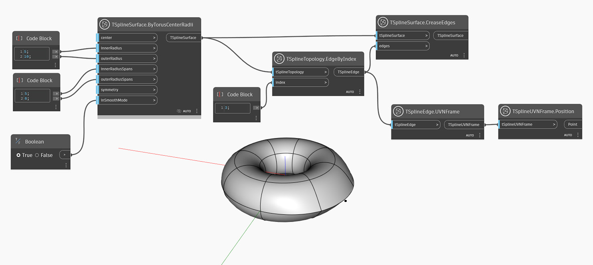

## In-Depth
`TSplineSurface.CreaseEdges` adiciona uma dobra aguda à aresta especificada em uma superfície da T-Spline.
No exemplo abaixo, é gerada uma superfície da T-Spline é gerada com base em um toroide da T-Spline. Uma aresta é selecionada usando o nó `TSplineTopology.EdgeByIndex` e uma dobra é aplicada a essa aresta com a ajuda do nó `TSplineSurface.CreaseEdges`. Os vértices em ambas as arestas da aresta também são dobrados. A posição da aresta selecionada é visualizada com a ajuda dos nós `TSplineEdge.UVNFrame` e `TSplineUVNFrame.Poision`.

## Arquivo de exemplo

