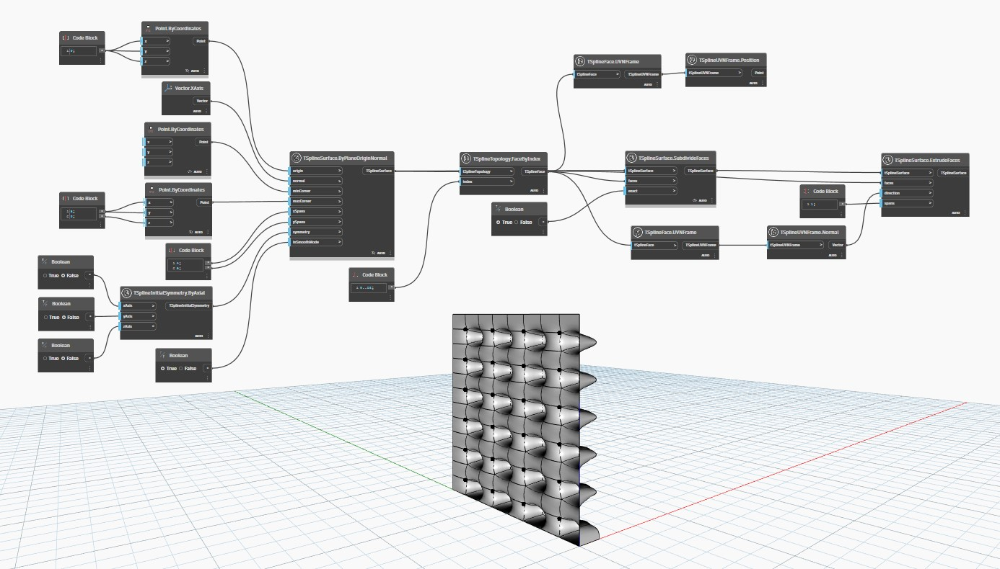

## Em profundidade
No exemplo abaixo, é criada uma superfície da T-Spline plana usando o nó `TSplineSurface.ByPlaneOriginNormal` e um conjunto de suas faces é selecionado e subdividido. Em seguida, essas faces são extrudadas simetricamente usando o nó `TSplineSurface.ExtrudeFaces`, com uma direção (nesse caso, o vetor Normal UVN das faces) e um número de vãos determinados. As arestas resultantes são deslocadas na direção especificada.
___
## Arquivo de exemplo

