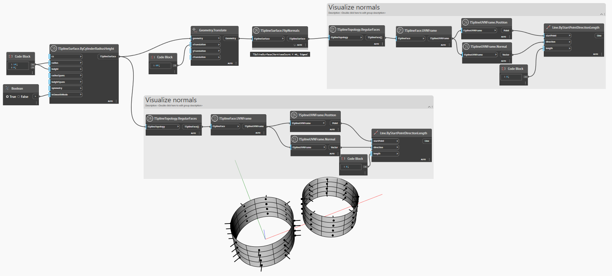

## Em profundidade
No exemplo abaixo, o efeito do nó `TSplineSurface.FlipNormals` é visualizado usando o elemento Estrutura UVN de todas as faces de uma superfície da T-Spline.
___
## Arquivo de exemplo

