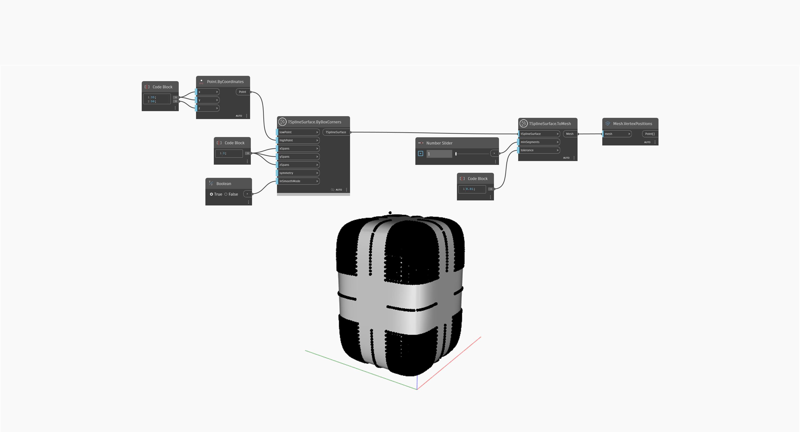

## Em profundidade
No exemplo abaixo, uma superfície de caixa da T-Spline simples é transformada em uma malha usando um nó `TSplineSurface.ToMesh`. A entrada `minSegments` define o número mínimo de segmentos para uma face em cada direção e é importante para controlar a definição da malha. A entrada `tolerance` corrige imprecisões adicionando mais posições de vértice para corresponder à superfície original dentro da tolerância especificada. O resultado é uma malha cuja definição é visualizada usando um nó `Mesh.VertexPositions`.
A malha de saída pode conter triângulos e quads, o que é importante ter em mente se você está usando nós do MeshToolkit.
___
## Arquivo de exemplo

