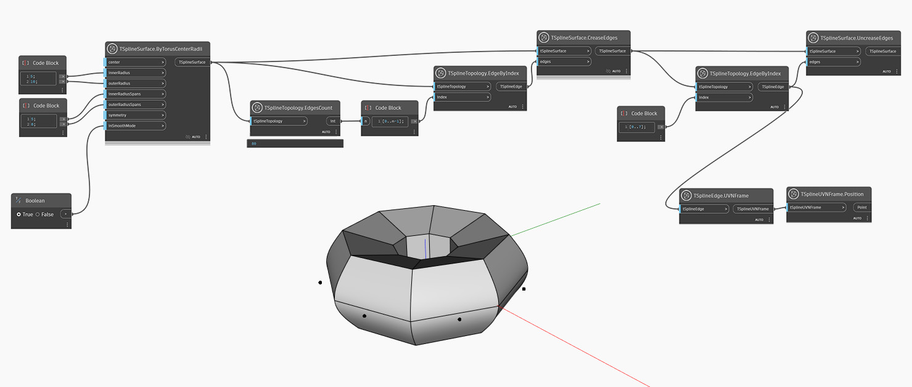

## In-Depth
Ao contrário do nó `TSplineSurface.CreaseEdges`, esse nó remove a dobra da aresta especificada em uma superfície da T-Spline.
No exemplo abaixo, é gerada uma superfície da T-Spline com base em um toroide da T-Spline. Todas as arestas são selecionadas usando os nós `TSplineTopology.EdgeByIndex` e `TSplineTopology.EdgesCount`, e a dobra é aplicada a todas as arestas com a ajuda do nó `TSplineSurface.CreaseEdges`. Em seguida, é selecionado um subconjunto das arestas com índices 0 a 7 e é aplicada a operação inversa – desta vez, usando o nó `TSplineSurface.UncreaseEdges`. A posição das arestas selecionadas é visualizada com a ajuda dos nós `TSplineEdge.UVNFrame` e `TSplineUVNFrame.Poision`.

## Arquivo de exemplo

