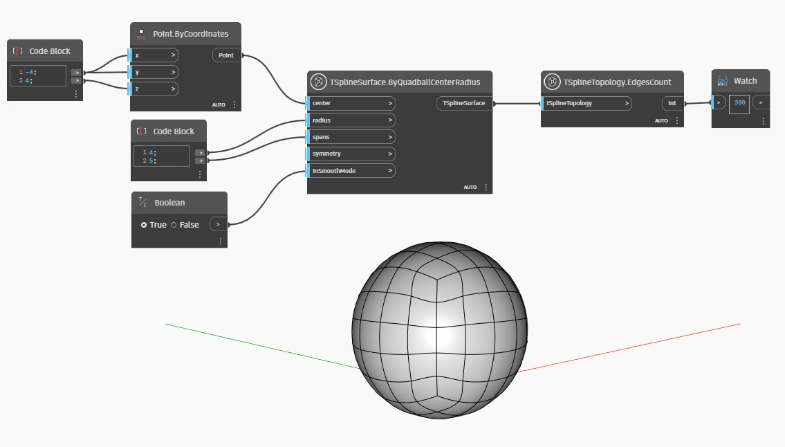

## Em profundidade
No exemplo abaixo, `TSplineTopology.EdgesCount` é usado para contar as arestas de um Quadball criado por um nó `TSplineSurface.ByQuadballCenterRadius`.
___
## Arquivo de exemplo

