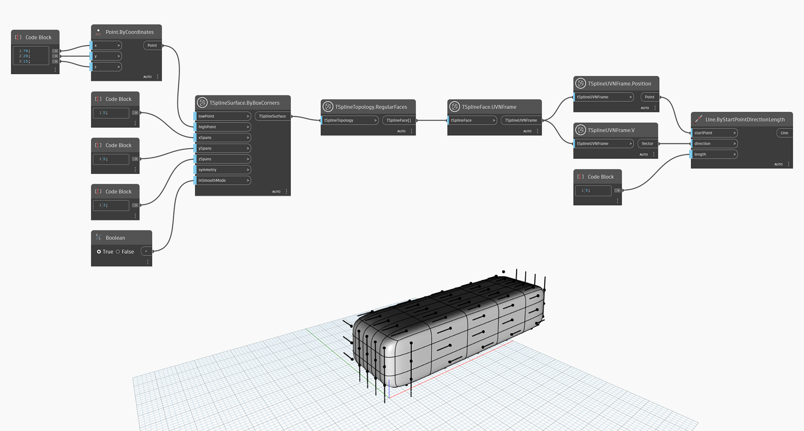

## In-Depth
`TSplineUVNFrame.V` retorna o vetor V da estrutura UVN. No exemplo abaixo, as linhas são usadas para visualizar a direção do vetor V em estruturas UVN de cada face do primitivo de caixa da T-Spline.

## Arquivo de exemplo

