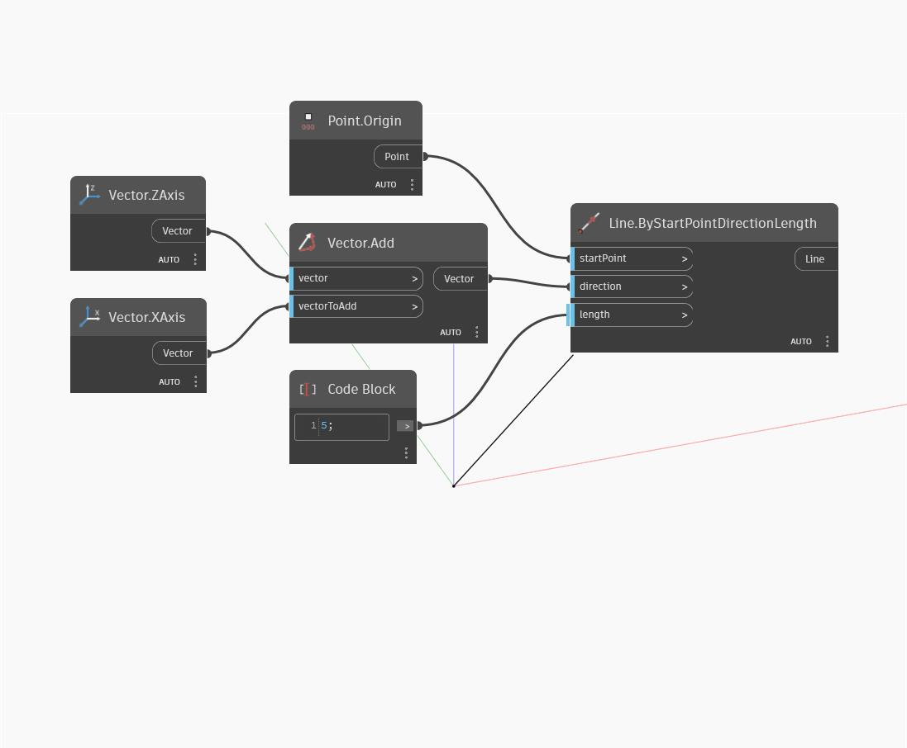

## Em profundidade
Add retornará um vetor que é a soma de outros dois vetores. No exemplo abaixo, a soma dos vetores do eixo Z e do eixo X do WCS resulta num vetor com coordenadas de (1,0,1). O novo vetor é representado como uma linha.
___
## Arquivo de exemplo

