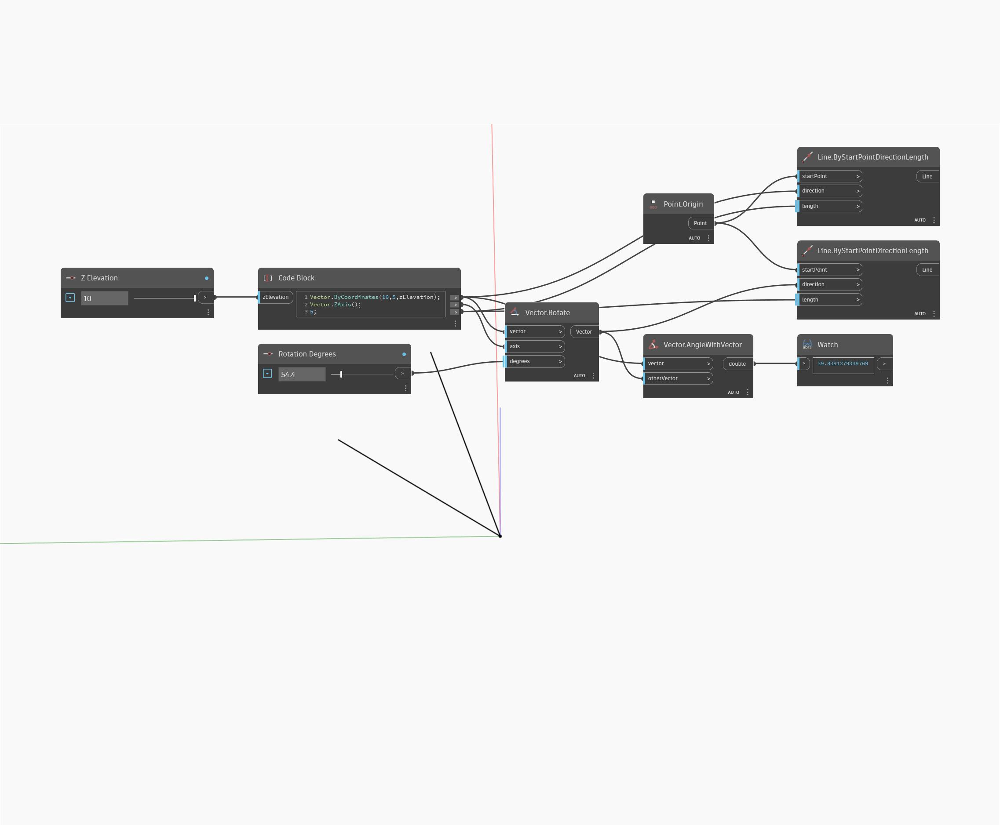

## Em profundidade
AngleWithVector retornará a medição do ângulo entre dois vetores em graus de 0 a 180. No exemplo abaixo, uma medição de ângulo é retornada para dois vetores. Ajuste os controles deslizantes Elevação Z e Graus de rotação para ver como eles afetam a medição do ângulo resultante. Os vetores são representados como linhas.
___
## Arquivo de exemplo

