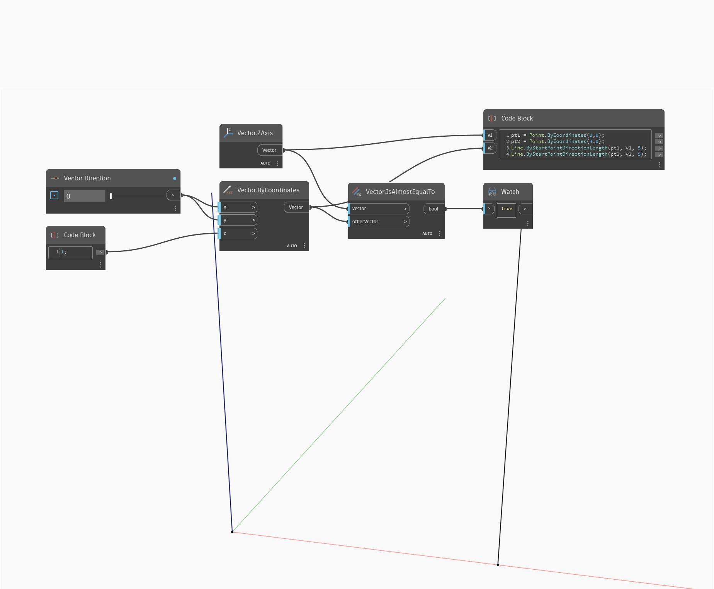

## Em profundidade
IsAlmostEqualTo retornará um valor booleano baseado em se um vetor tem os mesmos valores que outro. No exemplo abaixo, um valor True é retornado ao comparar um vetor no eixo Z do WCS com um vetor com coordenadas de (0,0,1). Ajustar o controle deslizante de direção do vetor alterará os valores de coordenadas do vetor tornando-o desigual. Os vetores são representados como linhas.
___
## Arquivo de exemplo

