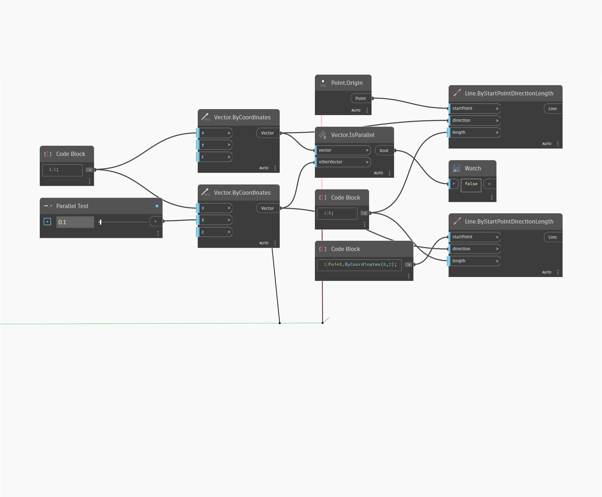

## Em profundidade
IsParallel retornará um valor booleano baseado em se um vetor é paralelo a outro vetor. No exemplo abaixo, dois vetores representados como linhas são comparados. Ajuste a barra deslizante para rotacionar um vetor para dentro e para fora do paralelo com o outro.
___
## Arquivo de exemplo

