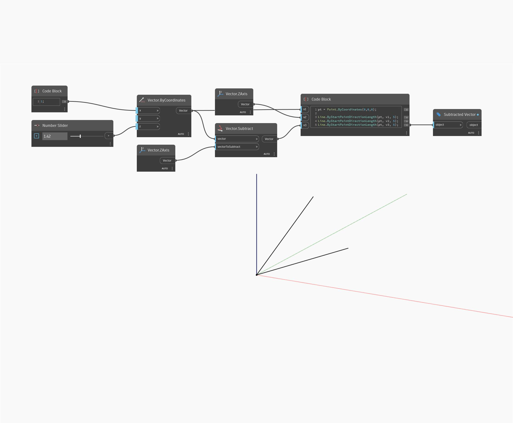

## Em profundidade
Subtract retornará um vetor que é a diferença de dois outros vetores. No exemplo abaixo, a diferença de um vetor com coordenadas (1,0,1) e o eixo Z do WCS resulta num vetor com coordenadas de (1,0,0). Ajustar o controle deslizante de Direção do vetor alterará os valores de coordenadas do vetor e retornará um vetor subtraído diferente. Os vetores são representados como linhas.
___
## Arquivo de exemplo

