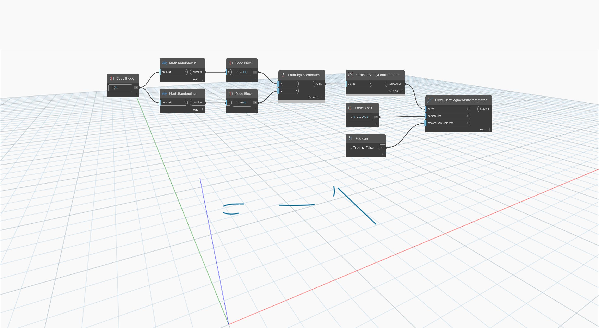

<!--- Autodesk.DesignScript.Geometry.Curve.TrimSegmentsByParameter(curve, parameters, discardEvenSegments) --->
<!--- BZCTQI2SIMCNMSCEHGSQLE6G74ND4ZQRICVGQCLVQ3OGHPBNX5NQ --->
## Em profundidade
`Curve.TrimSegmentsByParameter (parameters, discardEvenSegments)` primeiro divide uma curva em pontos determinados por uma lista de parâmetros de entrada. Em seguida, ele retorna os segmentos ímpares ou pares, conforme determinado pelo valor booleano da entrada `discardEvenSegments`.

No exemplo abaixo, primeiro criamos uma NurbsCurve usando um nó `NurbsCurve.ByControlPoints`, com um conjunto de pontos gerados aleatoriamente como entrada. Um `code block` é usado para criar um intervalo de números entre 0 e 1, avançando em 0,1. Usar isso como parâmetros de entrada para um nó `Curve.TrimSegmentsByParameter` resulta em uma lista de curvas que são efetivamente uma versão em linha tracejada da curva original.
___
## Arquivo de exemplo

