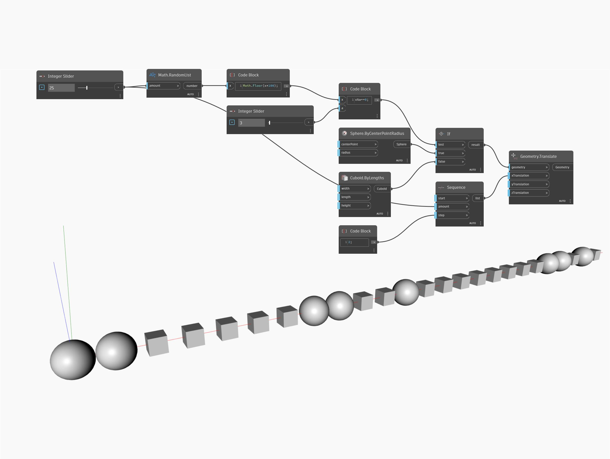

## Em profundidade
If age como um nó de controle condicional. A entrada `test` obtém um valor booleano, enquanto as entradas `true` e `false` podem aceitar qualquer tipo de dados. Se o valor de teste for `true`, o nó retornará o item da entrada `true`. Se o teste for `false`, o nó retornará o item da entrada `false`. No exemplo abaixo, primeiro geraremos uma lista de números aleatórios entre zero e 99. O número de itens na lista é estabelecido por um controle deslizante de números inteiros. Usamos um bloco de código com a fórmula `x%a==0` para testar a divisão por um segundo número, determinado por um segundo controle deslizante de número. Isso gera uma lista de valores booleanos correspondentes a se os itens na lista aleatória são divisíveis pelo número determinado pelo segundo controle deslizante de números inteiros. Essa lista de valores booleanos é usada como a entrada `test` para um nó If. Usamos uma esfera padrão como a entrada `true` e um cuboide padrão como a entrada `false`. O resultado do nó If é uma lista de esferas ou cuboides. Por fim, usamos um nó Translate para separar a lista de geometrias.

IF replica em todos os nós AS THOUGH SET TO SHORTEST. É possível ver o motivo para isso nos exemplos anexados, especialmente durante a análise de quais são os resultados quando LONGEST é aplicado a um nó de fórmula e a ramificação “curta” da condicional é aprovada. Essas alterações também foram feitas para permitir comportamento previsível ao usar entradas booleanas únicas ou uma lista de booleanos.
___
## Arquivo de exemplo

