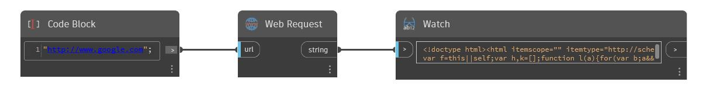

## Em profundidade
Web Request retornará o conteúdo de uma página da Web de uma URL de entrada como uma sequência de caracteres. No exemplo abaixo, uma solicitação da Web será feita em http://www.google.com e seu conteúdo HTML será retornado.
___
## Arquivo de exemplo

