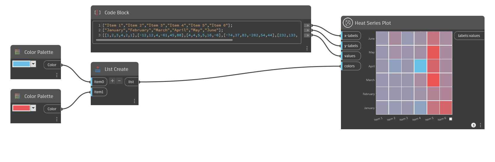

## Em profundidade

A plotagem de série de calor cria um gráfico onde os pontos de dados são representados como retângulos em cores diferentes ao longo de um intervalo de cores.

Atribua legendas para cada coluna e linha inserindo uma lista de legendas de sequência de caracteres nas entradas legendas x e legendas y, respectivamente. O número de legendas x e legendas y não precisa corresponder.

Defina um valor para cada retângulo com a entrada de valores. O número de sublistas deve corresponder ao número de valores de sequência de caracteres na entrada de legendas x, pois representa o número de colunas. Os valores dentro de cada sublista representam o número de retângulos em cada coluna. Por exemplo, 4 sublistas correspondem a 4 colunas e, se cada sublista tiver 5 valores, as colunas terão 5 retângulos cada.

Como outro exemplo, para criar uma grade com 5 linhas e 5 colunas, forneça 5 valores de sequência de caracteres na entrada de legendas x, bem como na entrada de legendas y. Os valores da legenda x aparecerão abaixo do gráfico ao longo do eixo x e os valores da legenda y aparecerão à esquerda do gráfico ao longo do eixo y.

Na entrada de valores, insira uma lista de listas, cada sublista contendo 5 valores. Os valores são plotados coluna por coluna da esquerda para a direita e de baixo para cima, de modo que o primeiro valor na primeira sublista seja o retângulo inferior na coluna da esquerda, o segundo valor é o retângulo acima disso e assim por diante. Cada sublista representa uma coluna na plotagem.

É possível atribuir um intervalo de cores para diferenciar os pontos de dados, inserindo uma lista de valores de cores na entrada de cores. O menor valor no gráfico será igual à primeira cor, e o maior valor será igual à última cor, com outros valores entre o gradiente. Se nenhum intervalo de cores for atribuído, os pontos de dados terão uma cor aleatória da cor mais clara para a mais escura.

Para obter melhores resultados, use uma ou duas cores. O arquivo de exemplo fornece um exemplo clássico de duas cores, azul e vermelho. Quando elas forem usadas como entradas de cores, a plotagem da série de calor criará automaticamente um gradiente entre essas cores, com valores baixos representados em tons de azul e valores altos em tons de vermelho.

___
## Arquivo de exemplo

