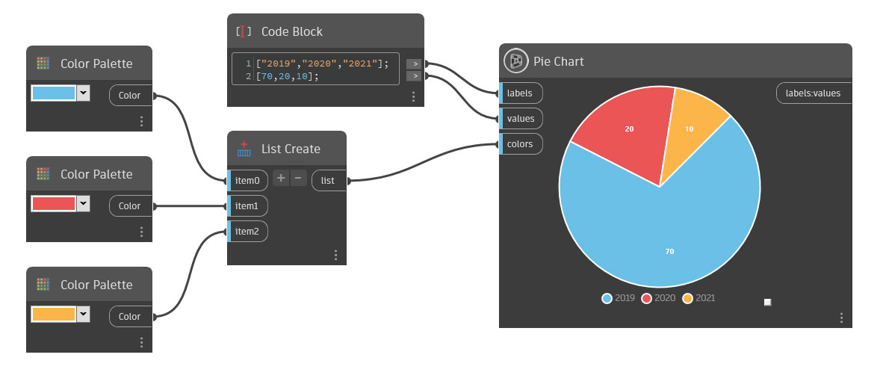

## Em profundidade

O Gráfico circular cria um gráfico circular dividido em segmentos. É possível inserir rótulos, cores e atribuir valores a cada segmento.

Rotule os segmentos inserindo uma lista de valores de sequência de caracteres na entrada de legendas. Por padrão, essas legendas são Item1, Item2 e Item3. As legendas são mostradas abaixo do gráfico circular.

Defina valores para cada segmento inserindo uma lista de valores duplos na entrada de valores. Observe que o número de valores deve ser igual ao número de legendas definidas na entrada de legendas. Esses valores podem ser maiores que 100.

Para atribuir uma cor para cada grupo, insira uma lista de cores na entrada de cores. Ao atribuir cores personalizadas, o número de cores deve corresponder ao número de valores de sequência de caracteres na entrada de legendas. Se nenhuma cor for atribuída, serão usadas cores aleatórias.

___
## Arquivo de exemplo

