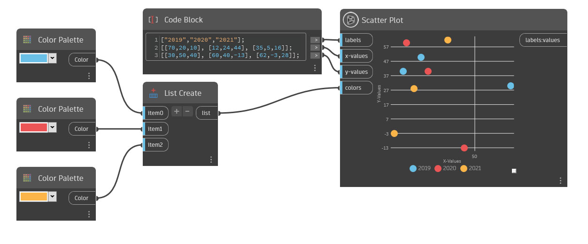

## Em profundidade

A plotagem de dispersão cria um gráfico com pontos plotados por seus valores x e y e codificados por cores com base no grupo.
Rotule os grupos ou altere o número de grupos inserindo uma lista de valores de sequência de caracteres na entrada de legendas. Cada legenda cria um grupo correspondente codificado por cores. Se você inserir somente um valor de sequência de caracteres, todos os pontos terão a mesma cor e uma legenda compartilhada.

Para determinar o posicionamento de cada ponto, use uma lista de listas contendo valores duplos para as entradas de valores x e y. Deve haver um número igual de valores nas entradas de valores x e y. O número de sublistas também deve se alinhar com o número de valores de sequência de caracteres na entrada de legendas.

Para atribuir uma cor para cada grupo, insira uma lista de cores na entrada de cores. Ao atribuir cores personalizadas, o número de cores deve corresponder ao número de valores de sequência de caracteres na entrada de legendas. Se nenhuma cor for atribuída, serão usadas cores aleatórias.

___
## Arquivo de exemplo

