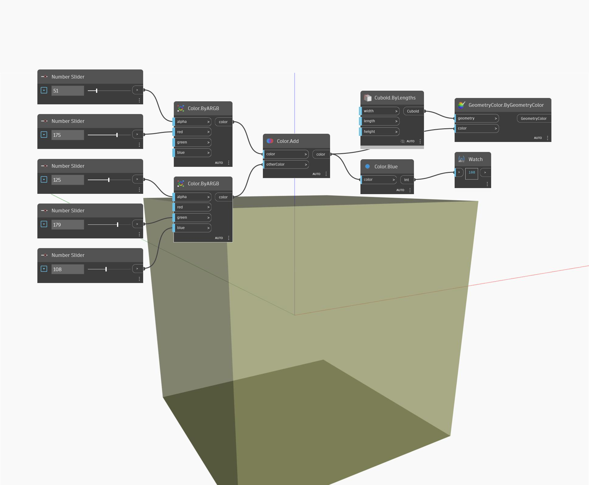

## Em profundidade
Blue retornará o valor azul de uma cor de entrada no intervalo de 0 a 255. No exemplo abaixo, criamos duas cores usando nós ByARGB e adicionamos as duas cores juntas. O valor azul da cor resultante é encontrado usando um nó Blue.
___
## Arquivo de exemplo

