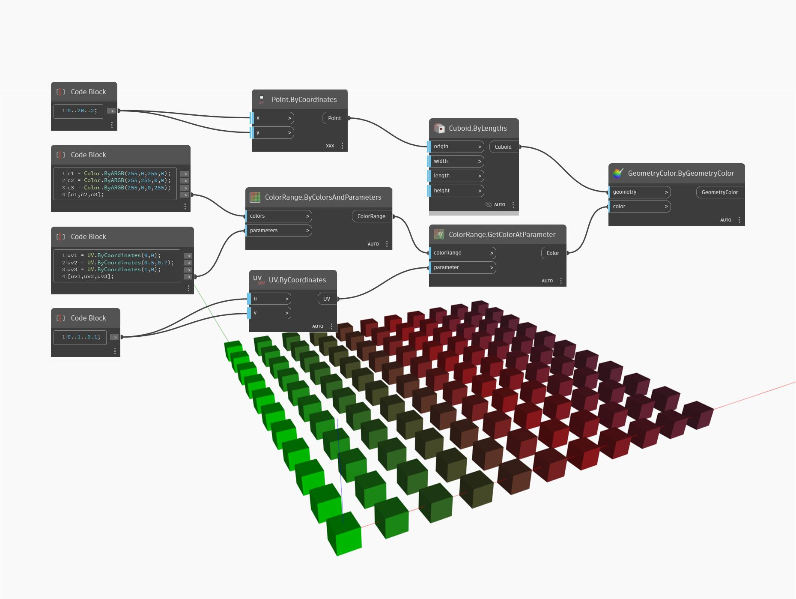

## Em profundidade
ByColorsAndParameters cria um intervalo de cores 2D com base em uma lista de cores de entrada e uma lista correspondente de parâmetros UV especificados no intervalo de 0 a 1. No exemplo abaixo, usamos um bloco de código para criar três cores diferentes (neste caso, simplesmente verde, vermelho e azul) e para combiná-las em uma lista. Usamos um bloco de código separado para criar três parâmetros UV, um para cada cor. Essas duas listas são usadas como entradas para um nó ByColorsAndParameters. Usamos um nó GetColorAtParameter subsequente, junto com um nó Display.ByGeometryColor para visualizar o intervalo de cores 2D em um conjunto de cubos.
___
## Arquivo de exemplo

