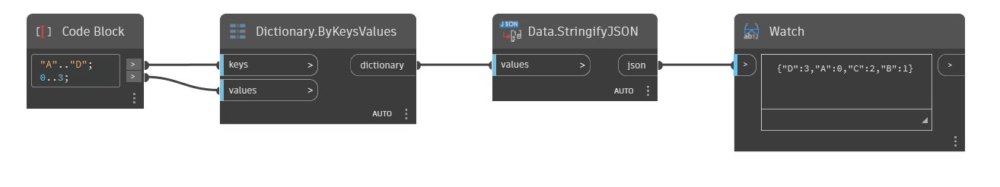

## Em profundidade
Data.StringifyJSON converte valores no formato JSON. O formato de arquivo JSON é uma convenção para estruturar os dados que você deseja armazenar. Na verdade, o próprio formato de arquivo do Dynamo é estruturado como JSON.
___
## Arquivo de exemplo

