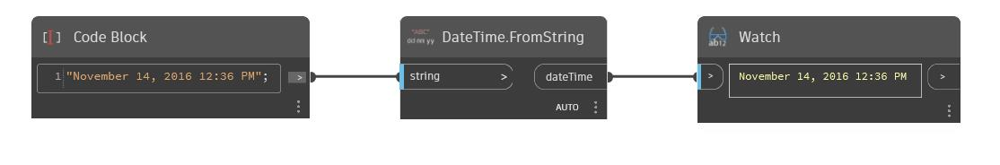

## Em profundidade
FromString retornará um intervalo de tempo de uma sequência de caracteres. No exemplo abaixo, uma sequência de caracteres “5:6:21” retornará um intervalo de tempo de 5 horas, 6 minutos e 21 segundos.
___
## Arquivo de exemplo

