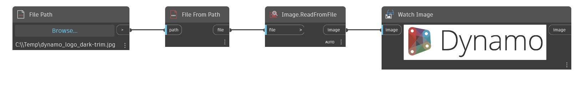

## Em profundidade
Read From File assume um arquivo como entrada. O arquivo deve ser um arquivo de texto que tenha dados separados por vírgulas. As diferentes linhas do arquivo correspondem à lista externa, enquanto os valores individuais em cada linha correspondem às listas internas. No exemplo abaixo, primeiro usamos um nó File Path e um nó File.FromPath para criar um objeto de arquivo que aponte para um arquivo de texto. Em seguida, usamos um nó ReadFromFile para criar uma lista com base no arquivo CSV.
___
## Arquivo de exemplo

