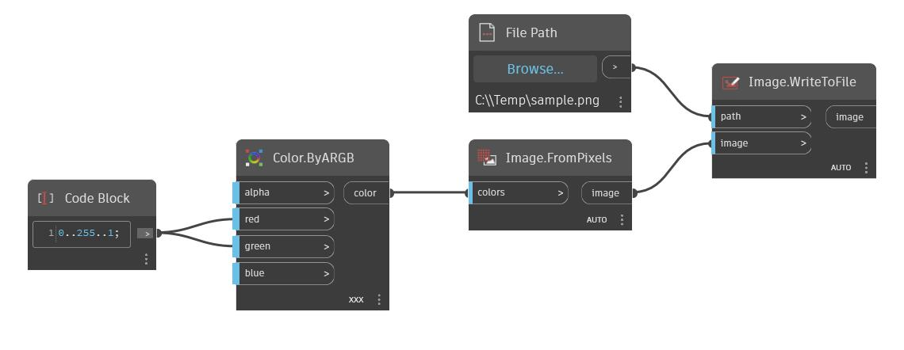

## Em profundidade
WriteToFile retornará uma Lista de listas que é escrita em um arquivo do Excel. O nome da folha, a linha inicial e a coluna inicial de onde gravar os dados podem ser definidos como entradas, bem como se os dados existentes serão sobrescritos. No exemplo abaixo, uma Lista de listas que contém uma sequência numérica é escrita no arquivo sampleexcel.xlsx começando na linha 0 (ou 1 no Excel) e na coluna 1 (ou B no Excel). O arquivo do Excel agora tem nove novas colunas com dados em duas linhas existentes. Capturas de tela de sampleexcel.xlsx antes e depois da escrita são sobrepostas para mostrar os dados no formato do Excel.
___
## Arquivo de exemplo

