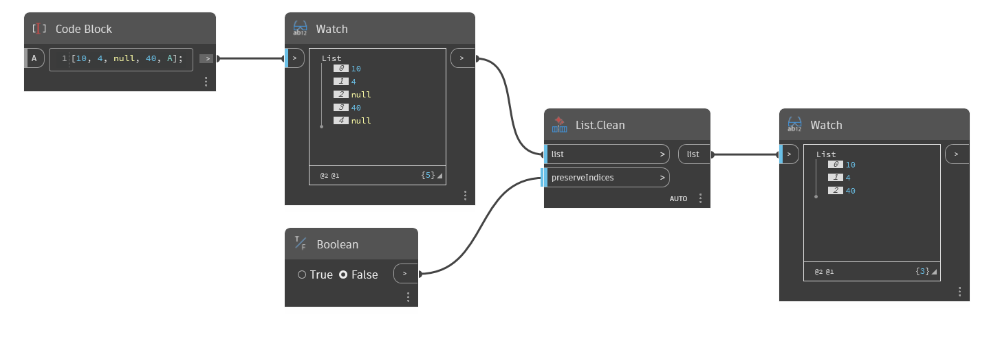

## Em profundidade
`List.Clean` retorna uma lista sem nulos e listas vazias.

No exemplo abaixo, `List.Clean` remove dois valores nulos de uma lista, retornando somente os números inteiros. A entrada `preserveIndices` pode ser alternada por um valor booleano para manter os índices que antes continham nulos.
___
## Arquivo de exemplo

