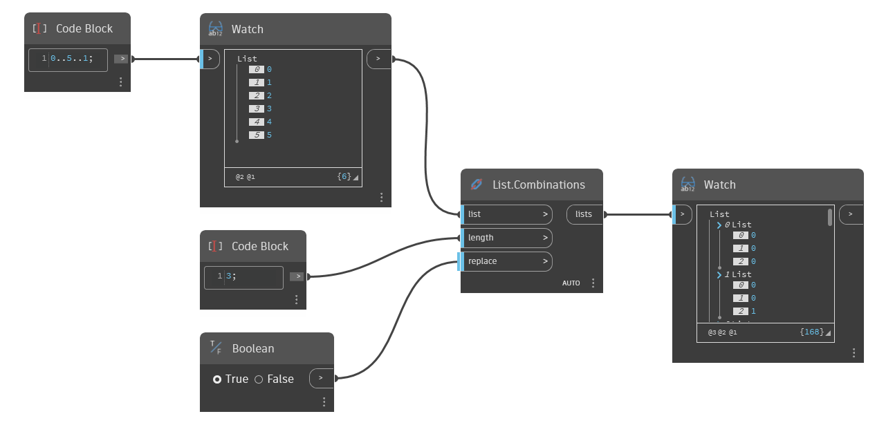

## Em profundidade
`List.Combinations` retorna uma lista aninhada que inclui todas as combinações possíveis dos itens na lista de entrada com um determinado comprimento. Para combinações, a ordem dos elementos não importa; portanto, a lista de saída (0,1) é considerada a mesma combinação que (1,0). Se `replace` estiver definido como True, os itens serão substituídos na lista original, permitindo que eles sejam usados repetidamente em uma combinação.

No exemplo abaixo, usamos um bloco de código para gerar um intervalo de números de 0 a 5, com passo igual a 1. Usamos `List.Combinations` com um comprimento de entrada de 3 para gerar todas as diferentes formas de combinar 3 dos números no intervalo. O booleano `replace` é definido como True para que os números sejam usados repetidamente.
___
## Arquivo de exemplo

