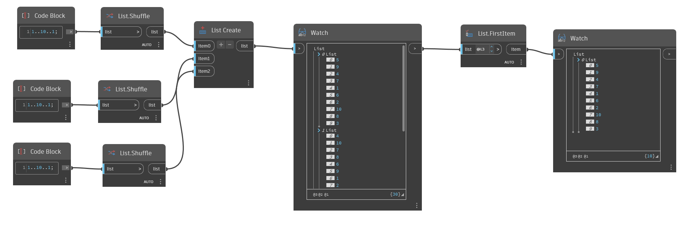

## Em profundidade
`List.FirstItem` retorna o primeiro item de uma lista de entrada.

No exemplo abaixo, geramos uma lista com três sublistas de 10 números aleatórios entre 1 e 10. Em seguida, usamos um nó FirstItem para retornar o primeiro item da lista.

Use o selecionador de nível de lista no nó `List.FirstItem` para experimentar diferentes formas de retornar o primeiro item de uma lista aninhada. Definir como L1 retorna todos os itens de todas as sublistas como uma lista única e nivelada. Definir como L2 retorna o primeiro item de cada sublista. Definir como L3 retorna todos os itens na lista 0.
___
## Arquivo de exemplo

