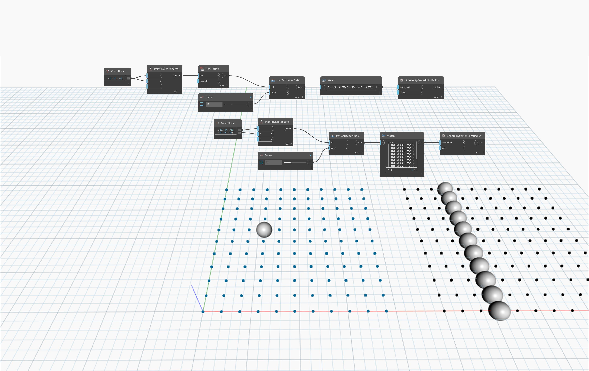

## Em profundidade
`List.Flatten` retorna uma lista unidimensional (uma lista com um único nível) de uma lista multidimensional (uma lista com pelo menos uma lista aninhada).

No exemplo abaixo, duas estruturas de lista de uma grade de ponto são comparadas criando uma esfera em um índice especificado de cada grade. A lista nivelada de pontos retorna 1 ponto em uma localização de índice. A lista desnivelada retorna 10 pontos em uma localização de índice, pois cada índice contém uma linha de pontos.
___
## Arquivo de exemplo

