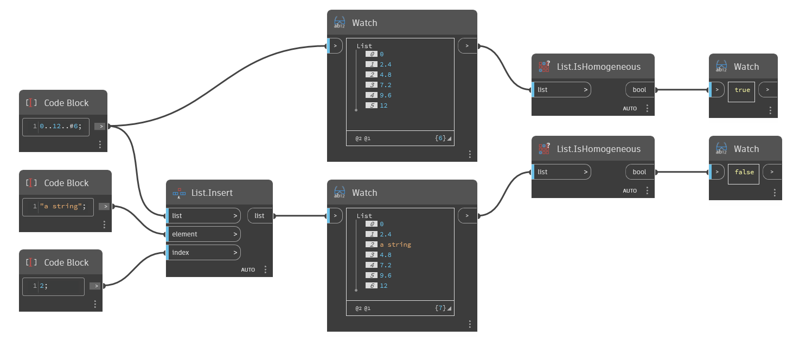

## Em profundidade
`List.IsHomogeneous` retorna um valor booleano com base no fato de os elementos em uma lista serem todos do mesmo tipo.

No exemplo abaixo, uma simples lista de números é comparada com a mesma lista com uma sequência de caracteres inserida. A lista original é homogênea (somente números), então `List.IsHomogeneous` retorna True. A nova lista não é homogênea (números e uma sequência de caracteres), então `List.IsHomogeneous` retorna False.
___
## Arquivo de exemplo

