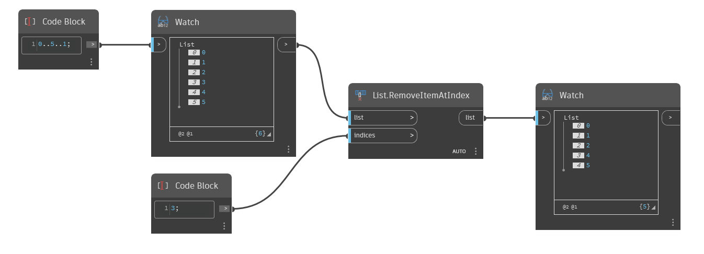

## Em profundidade
`List.RemoveItemAtIndex` remove itens de uma lista de entrada em um índice ou índices determinados.

No exemplo abaixo, começamos com uma faixa de números de 0 a 5. Em seguida, removemos o item com índice 3.
___
## Arquivo de exemplo

