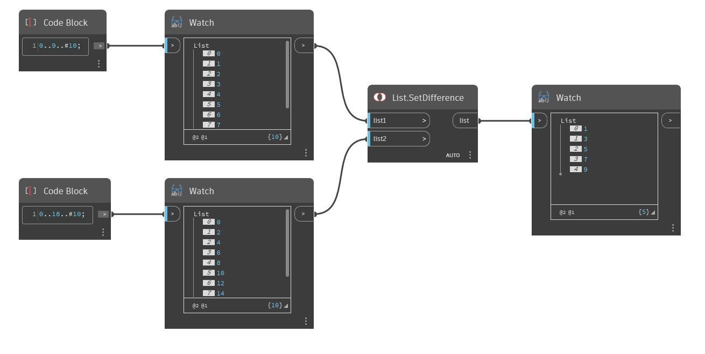

## Em profundidade
`List.SetDifference` retorna uma nova lista que inclui somente os objetos de list1 que não estão também em list2.

No exemplo abaixo, uma lista de 0 a 9, com passo igual 1, é comparada a uma lista de 0 a 18, com passo igual a 2. `List.SetDifference` retorna números ímpares abaixo de 10 porque eles estão contidos apenas em List1 e não em List2.
___
## Arquivo de exemplo

