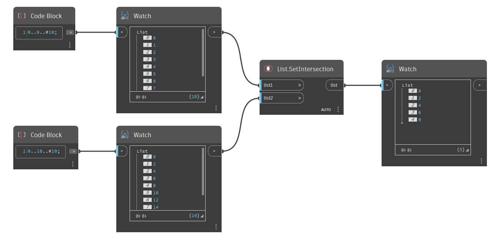

## Em profundidade
`List.SetIntersection` retorna uma nova lista que inclui somente os objetos contidos em ambas as listas de entrada.

No exemplo abaixo, `List.SetIntersection` compara uma lista de 0 a 9, com passo igual a 1, a uma lista de 0 a 18, com passo igual a 2. Números iguais abaixo de 10 são retornados porque estão contidos em List1 e List2.
___
## Arquivo de exemplo

