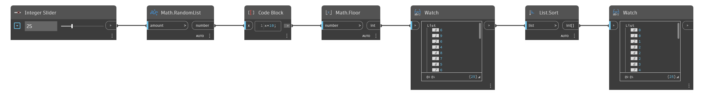

## Em profundidade
`List.Sort` organiza uma lista de itens de acordo com a ordem integrada para o tipo de dados. Por exemplo, uma lista de números é classificada do menor para o maior, enquanto uma lista de sequências de caracteres é classificada em ordem alfabética.

No exemplo abaixo, usamos `Math.RandomList` para primeiro gerar uma lista de números aleatórios entre 0 e 1. Em seguida, multiplicamos por 10 e usamos uma operação `Math.Floor` para obter uma lista de números inteiros aleatórios entre 0 e 9. Em seguida, `List.Sort` cria uma lista ordenada do menor para o maior número.
___
## Arquivo de exemplo

