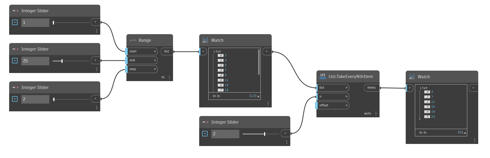

## Em profundidade
`List.TakeEveryNthItem` produz uma nova lista contendo apenas os itens da lista de entrada que estão em intervalos do valor n de entrada. O ponto inicial do intervalo pode ser alterado com a entrada `offset`. Por exemplo, inserir 3 em n e deixar o deslocamento como padrão 0 manterá os itens com índices 2, 5, 8 etc. Com um deslocamento de 1, os itens com índices 0, 3, 6 etc. Observe que o deslocamento “envolve” toda a lista. Para remover itens selecionados em vez de mantê-los, consulte `List.DropEveryNthItem`.

No exemplo abaixo, primeiro geramos uma lista de números usando `Range` e, em seguida, mantemos todos os outros números usando 2 como entrada para n.
___
## Arquivo de exemplo

