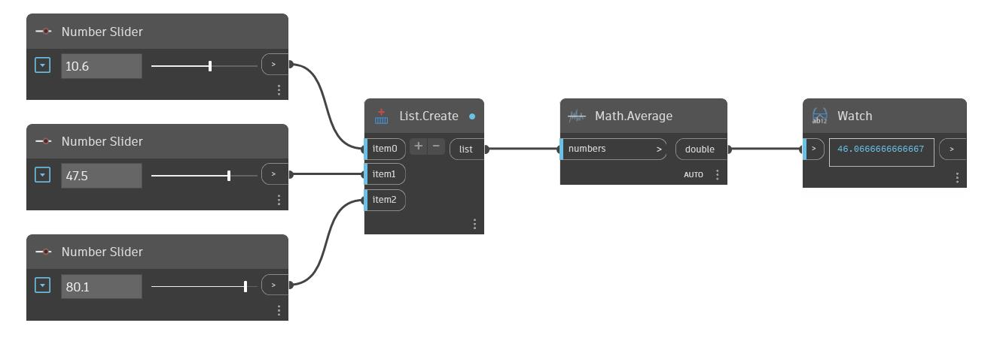

## Em profundidade
Average retornará a média (média aritmética) de uma lista de números. No exemplo abaixo, primeiro usamos três controles deslizantes de número para criar três números para encontrar a média. Depois, usamos um nó List.Create para combinar esses três números em uma lista que depois podemos usar como entrada para um nó Average.
___
## Arquivo de exemplo

