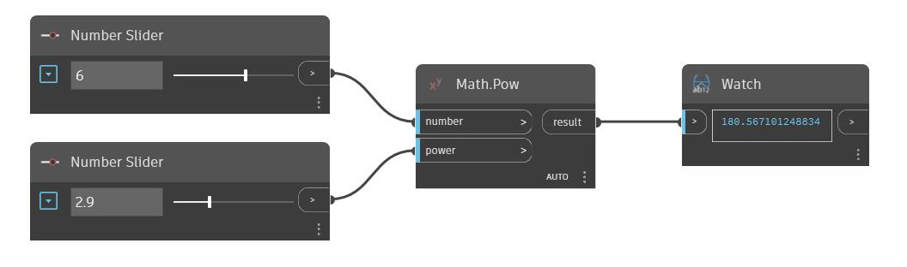

## Em profundidade
Pow retornará o resultado de um número de entrada elevado a uma potência de entrada. No exemplo abaixo, usamos dois controles deslizantes de número para controlar as duas entradas para um nó Pow.
___
## Arquivo de exemplo

