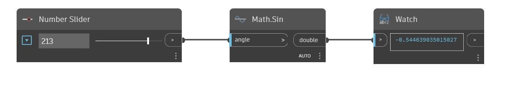

## Em profundidade
Sin retornará o seno de um ângulo de entrada em graus. No exemplo abaixo, usamos um controle deslizante definido no intervalo de -360 a 360 para controlar o ângulo de entrada para um nó Sin.
___
## Arquivo de exemplo

